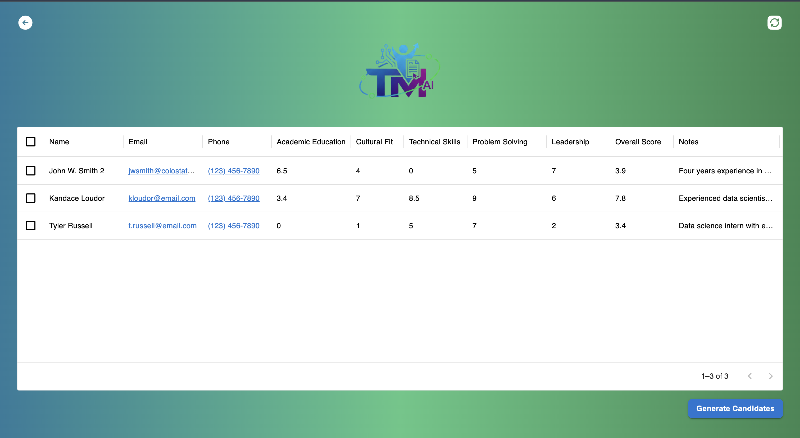
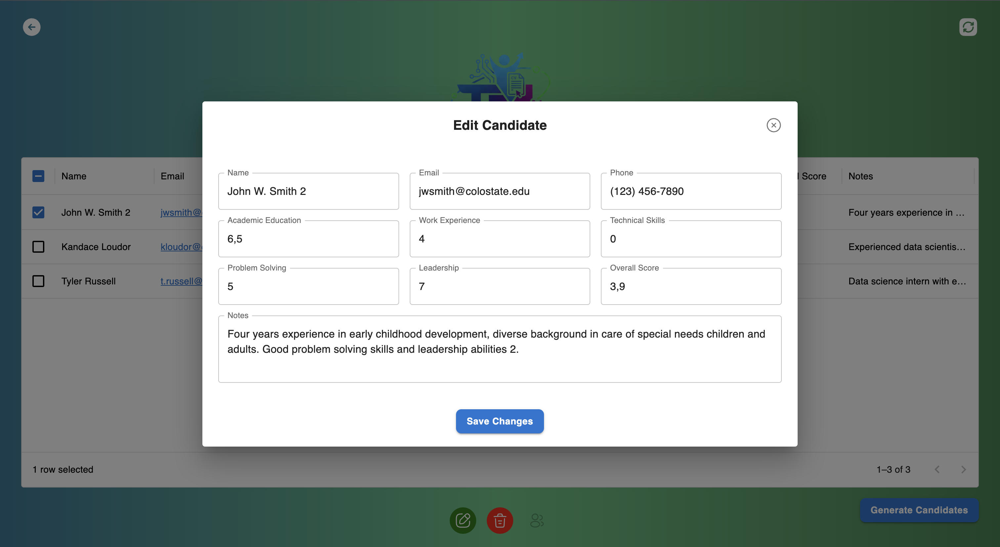
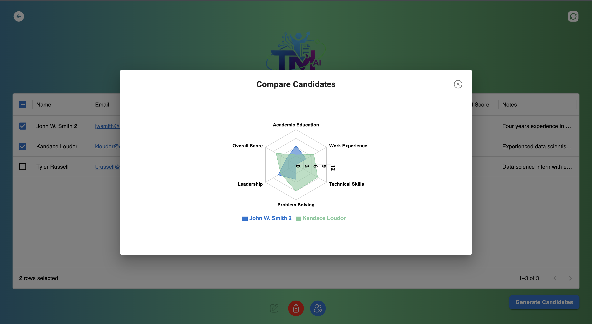

# TalentMatchAI

TalentMatchAI is a full-stack [TypeScript](https://www.typescriptlang.org/) project composed of three main parts:

- Backend – Node.js with MongoDB
- Frontend – React
- AI – Powered by Ollama

Built entirely with TypeScript for consistency, type safety, and maintainability.

## Description

TalentMatchAI is an application that uses AI to process resumes in PDF format and match candidates with job vacancies. You can edit and delete candidates, and additionally compare their results using a radar chart. The focus of this project wasn't to invest a lot of time on the frontend. Just a clean and simple design. This could be improved in the future.

## Features

### Backend

- PDF file reading.
- Text extraction from PDF files.
- Gmail data manipulation.
- RESTful API for communication with the Frontend.
- Communication with Ollama API.
- Communication with MongoDB Atlas.

### Frontend

- User interface for interaction with the end user.
- Displays the results of the candidates.
- Edit candidates.
- Compare two candidates using a radar chart showing their scores across key skills.

### Local AI LLM

- Natural Language Processing (NLP) for CV analysis.
- Matching algorithms to find suitable candidates for job vacancies.

## Prerequisites

- [Node.js](https://nodejs.org/en) installed
- [PNPM](https://pnpm.io/) installed
- [React](https://react.dev/) installed
- [Ollama](https://www.ollama.com/) & [mistral:instruct](https://ollama.com/library/mistral:instruct) Installed
- [Google Cloud Console](https://console.cloud.google.com/) (GMAIL API Enabled)
- [MongoDB Atlas Cluster](https://www.mongodb.com/atlas)

## Create Credentials for your Gmail API

1. Go to the Google Cloud Console
2. Create a new project
3. Enable Gmail API
4. Create a new OAuth 2.0 Client
5. Create a new client secret & download the ".json" file
6. Rename it to "credentials.json" and move it to the emailFiles folder on the backend here in the project
7. Add to the Authorized redirect URIs : "http://localhost:3000/oauth2callback"
8. Click to Audience on the left (Side Menu)
9. Add a new test user (add the email that you are testing for example)

You can always follow this tutorial if you get lost: [Tutorial](https://youtu.be/j7JlI6IAdQ0?si=pvC0C2m0HK-Z-Gdk)

Must Read: When you run the front end for the first time, click on the Generate Candidates button, it will open a pop-up tab to give Gmail permissions for that app. Allow that, it will create the token.json in the emailFiles folder. After that it will be automatic. It it fails after a few days, just delete the token.json and do everything again. This could be automated in the future.

## Installation

1.  Clone this repository:

    ```bash
    git clone https://github.com/your-user/TalentMatchAI-Public.git

2. Install dependencies for the project

    ```bash
    cd TalentMatchAI-Public
    pnpm i
    ```

3.  Install dependencies for backend

    ```bash
    cd backend
    pnpm i
    ```

4.  Install dependencies for frontend

    ```bash
    cd ../frontend
    pnpm i
    ```

5.  Create a .env file inside the main project folder with the Connection String for the MongoDB and the Backend Port

    ```bash
    BACKEND_PORT = ...
    DATABASE_URL = ...
    ```

6.  Run the entire project with one command on the main folder(TalentMatchAI)

    ```bash
    pnpm start
    ```

    Or run it separately

    ```bash
    pnpm start:server

    pnpm start:web

    pnpm start:ai
    ```

## Screenshots (Demo)

### Table



### Edit



### Compare Candidates



